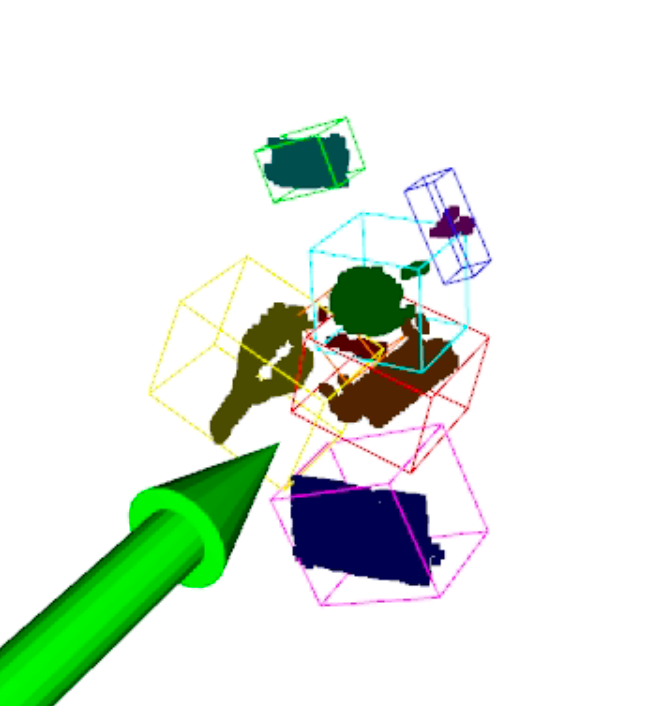

# 3D Object Detection with Frustum-PointNets

This repository contains an implementation of 3D object detection using Frustum-PointNets. The system takes RGB images and depth data as input and outputs 3D bounding boxes for detected objects.



## Overview

The project implements a two-stage 3D object detection pipeline:
1. 2D object detection using pre-trained YOLOv11 to generate frustums
2. 3D object detection using Frustum-PointNet to predict 3D bounding boxes

Key features:
- Frustum-based point cloud processing
- Multi-class 3D object detection
- Support for both KITTI and custom datasets
- Comprehensive evaluation metrics

## Installation

### Prerequisites
- Python 3.7+
- CUDA-capable GPU
- Linux environment

### Setup
1. Clone the repository:
```bash
git clone https://github.com/robertsenputras/3bbox_det.git
cd 3bbox_det
```

2. Install dependencies:
```bash
pip install -r requirements.txt
```

## Dataset

### Download Dataset
The raw dataset should be placed in `data/dl_challenge` with the following structure:
```
data/dl_challenge/
├── <scene_id_1>/
│   ├── rgb.jpg
│   ├── depth.npy
│   ├── mask.npy
│   └── bbox3d.npy
├── <scene_id_2>/
...
```

### Optional: Prepare YOLO Dataset
If you want to create a YOLO format dataset (not required for inference as we use pre-trained YOLO):
```bash
python create_yolo_dataset.py
```

## Training Frustum-PointNet

### Configuration
1. Navigate to the frustum_detection directory:
```bash
cd frustum_detection
```

2. Modify the training configuration in `configs/train_config.yaml`:
```yaml
# Model configuration
model_version: 'v1'
pretrained_weights: null

# Data configuration
data_root: '../data/dl_challenge'
train_val_split: 0.8
num_points: 2048

# Training configuration
batch_size: 8
num_epochs: 50
learning_rate: 0.0001
weight_decay: 0.0001
```

### Start Training
1. Train the model from the frustum_detection directory:
```bash
python train.py \
    --cfg configs/train_config.yaml \
    --output_dir ../runs/training
```

2. Monitor training progress:
- Training logs are saved in `runs/training/training.log`
- TensorBoard visualizations are available in `runs/training`

### Resume Training
To resume training from a checkpoint:
```bash
python train.py \
    --cfg configs/train_config.yaml \
    --output_dir ../runs/training \
    --resume \
    --weights path/to/checkpoint.pth
```

## Testing

### Evaluate Frustum-PointNet
1. From the frustum_detection directory, run evaluation:
```bash
python test_3d.py --config configs/test_config.yaml --visualize --weights ../ckpt/frustrum_2206_1007.pth
```

2. The evaluation script will output:
- Segmentation accuracy
- 2D/3D IoU metrics
- 3D box estimation accuracy (IoU=0.7)
- Detection AP for different difficulty levels

### Run Complete Pipeline
To run the complete detection pipeline (YOLO + Frustum-PointNet) on new data:
```bash
python unified_detection.py --config.yaml
```

## Model Architecture

The Frustum-PointNet architecture consists of three main components:
1. **3D Instance Segmentation PointNet**
   - Segments points in frustum to foreground/background
   
2. **T-Net**
   - Estimates center of object for translation normalization
   
3. **Box Estimation PointNet**
   - Predicts 3D bounding box parameters (center, size, heading)

## Evaluation Metrics

The model is evaluated using:
- 3D IoU (Intersection over Union)
- Bird's eye view IoU
- Average Precision (AP) at different IoU thresholds
- Segmentation accuracy

## Citation

If you use this code in your research, please cite:

```
@inproceedings{qi2018frustum,
  title={Frustum PointNets for 3D Object Detection from RGB-D Data},
  author={Qi, Charles R and Liu, Wei and Wu, Chenxia and Su, Hao and Guibas, Leonidas J},
  booktitle={Proceedings of the IEEE Conference on Computer Vision and Pattern Recognition},
  year={2018}
}
```

## License

This project is licensed under the MIT License - see the [LICENSE](LICENSE) file for details.